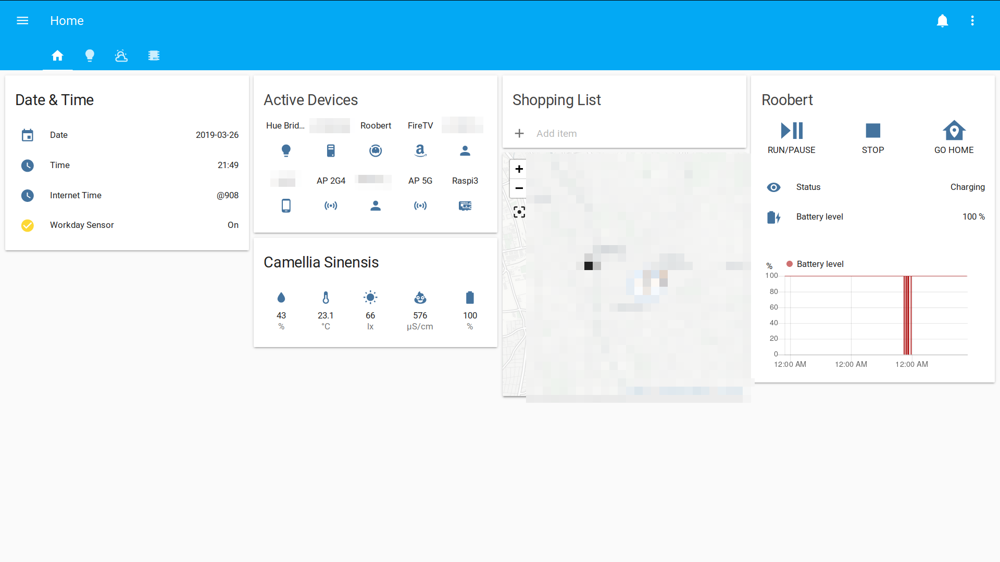
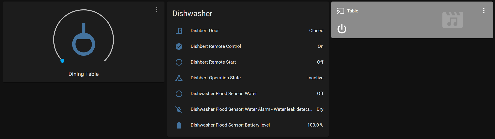
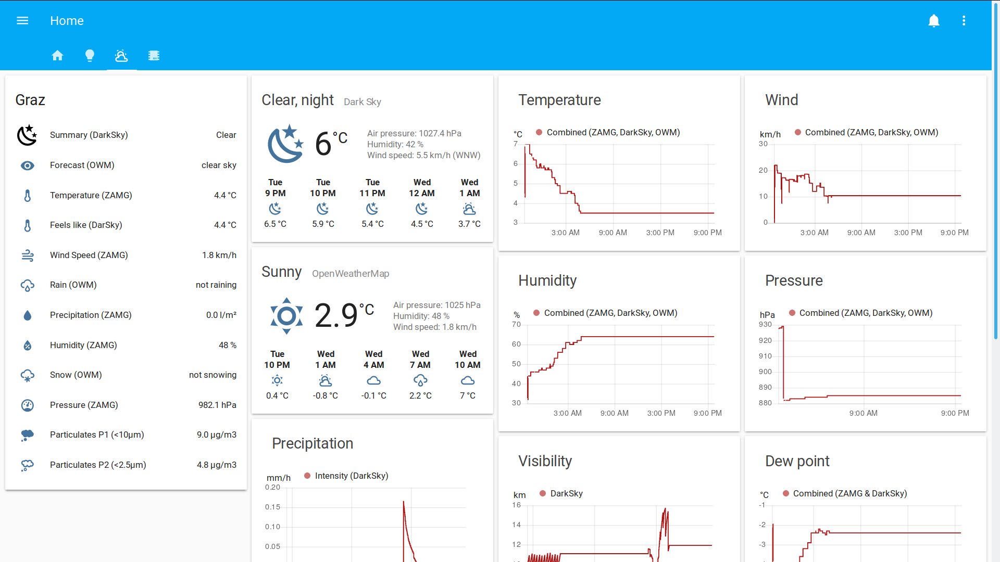
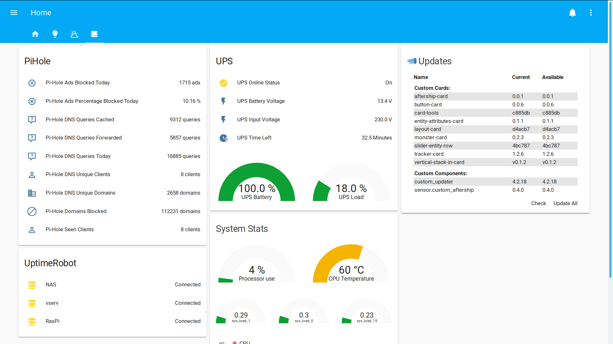

# grubfx Home Assistant

work in progress, changing stuff all the time

## // TODOs
- Configuration
  - fix graphs
  - convert `_combined` sensors templates to `min_max` sensor, type `mean`
  - fix `device_sun_light_trigger` component
- UI
  - try out themes

